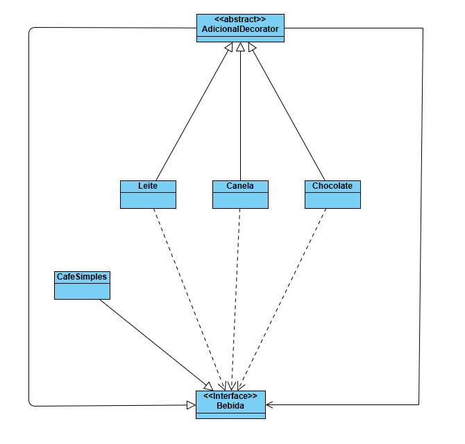

# Padrão de Projeto Decorator - Cafeteria
Este projeto é uma demonstração prática do padrão de projeto estrutural Decorator, aplicado a um cenário de uma cafeteria. O objetivo é ilustrar como adicionar dinamicamente ingredientes extras a uma bebida, alterando seu preço e descrição sem modificar a classe da bebida original.

## Conceito
O padrão Decorator permite que um objeto tenha seu comportamento estendido em tempo de execução. Em vez de usar herança para criar uma subclasse para cada combinação possível de ingredientes (como CafeComLeite, CafeComChocolate, CafeComLeiteEChocolate, etc.), usamos objetos "decoradores" que envolvem a bebida base.

Neste exemplo, temos uma bebida base, o CafeSimples. Cada ingrediente adicional (Leite, Chocolate, Canela) é um decorador que envolve a bebida, adicionando seu próprio custo e modificando a descrição final do produto.

## Estrutura
O projeto é organizado em torno da interface ```Bebida```, que define as operações comuns para a bebida base e seus adicionais.

- **Bebida:** Interface que define os métodos que tanto o objeto original quanto os decoradores devem implementar (```getPreco()``` e ```getDescricao()```).

- **CafeSimples:** Classe base que representa o objeto inicial ao qual serão adicionadas novas responsabilidades.

- **AdicionalDecorator:** Classe abstrata que implementa a interface Bebida. Ela mantém uma referência ao objeto Bebida que está sendo decorado.

- **Leitea / Chocolate / Canela:** Classes que estendem AdicionalDecorator e adicionam as funcionalidades específicas, como o acréscimo no preço e a concatenação na descrição da bebida.

## Diagrama de Classes


